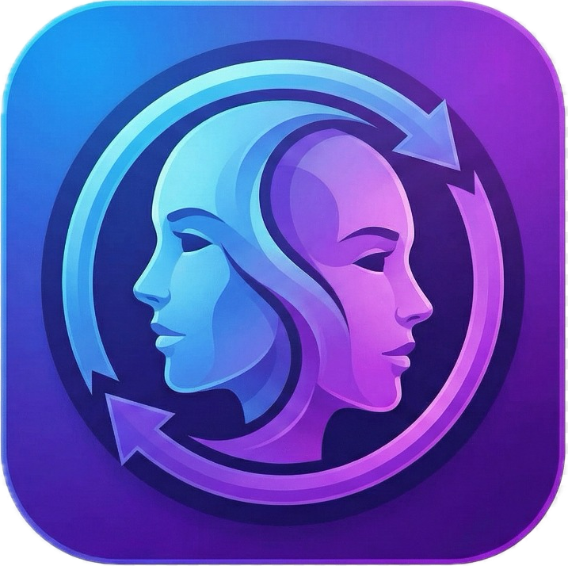

<div align="center">
  

  <h1>FaceSwap Application</h1>

  <p>
    A high-quality, real-time face swapping desktop application powered by Deep Learning (InsightFace) and Geometric (MediaPipe + Delaunay) engines — built with Python and PyQt5.
  </p>

  <p>
    
    
    
    
    
    
  </p>
</div>

---

## 📋 Table of Contents

- [Overview](#-overview)
- [Screenshots](#-screenshots)
- [Example Results](#-example-results)
- [Features](#-features)
- [System Requirements](#-system-requirements)
- [Project Structure](#-project-structure)
- [Installation](#-installation)
- [Usage](#-usage)
- [Technical Architecture](#-technical-architecture)
- [Performance](#-performance)
- [Troubleshooting](#-troubleshooting)
- [Important Notes](#-important-notes)
- [Dependencies](#-dependencies-summary)
- [License](#-license)

---

## 🧠 Overview

FaceSwap Application is a desktop tool that swaps faces between two photographs using state-of-the-art deep learning models. It ships with two independent processing engines:

- **Deep Learning Engine** — Uses the `inswapper_128` ONNX model from InsightFace to produce photorealistic, identity-preserving face swaps.
- **Geometric Engine** *(Experimental)* — Uses MediaPipe Face Mesh (468 landmarks) combined with Delaunay triangulation and Poisson blending. This engine is included for research and comparison purposes only — results are noticeably lower quality and it is **not recommended for practical use**.

Both engines run in a background thread to keep the GUI fully responsive during processing, and both support NVIDIA GPU acceleration via CUDA for near-instant results.

---

## 🖥️ Screenshots

<div align="center">

**Multi-face group photo — selecting a specific face from the crowd**


<br/><br/>

**Sports photo swap — athlete face replacement with background preservation**


<br/><br/>

**Portrait swap — clean single-face, high-fidelity result**


</div>

---

## 📸 Example Results

Input photos and their corresponding swap outputs:

<div align="center">
  
  
  <br/>
  <sub>Input Image A &nbsp;&nbsp;&nbsp;&nbsp;&nbsp;&nbsp;&nbsp;&nbsp;&nbsp;&nbsp;&nbsp;&nbsp;&nbsp;&nbsp;&nbsp;&nbsp;&nbsp;&nbsp;&nbsp;&nbsp;&nbsp;&nbsp;&nbsp;&nbsp;&nbsp;&nbsp;&nbsp;&nbsp;&nbsp;&nbsp;&nbsp;&nbsp;&nbsp;&nbsp;&nbsp;&nbsp;&nbsp;&nbsp;&nbsp;&nbsp;&nbsp;&nbsp;&nbsp;&nbsp;&nbsp;&nbsp;&nbsp;&nbsp;&nbsp;&nbsp;&nbsp;&nbsp;&nbsp;&nbsp;&nbsp;&nbsp;&nbsp;&nbsp;&nbsp;&nbsp;&nbsp;&nbsp;&nbsp;&nbsp;&nbsp;&nbsp;&nbsp;&nbsp;&nbsp;&nbsp;&nbsp; Input Image B</sub>
  <br/><br/>
  
  
  <br/>
  <sub>Result: Face A → Body B &nbsp;&nbsp;&nbsp;&nbsp;&nbsp;&nbsp;&nbsp;&nbsp;&nbsp;&nbsp;&nbsp;&nbsp;&nbsp;&nbsp;&nbsp;&nbsp;&nbsp;&nbsp;&nbsp;&nbsp;&nbsp;&nbsp;&nbsp;&nbsp;&nbsp;&nbsp;&nbsp;&nbsp;&nbsp;&nbsp;&nbsp;&nbsp;&nbsp;&nbsp;&nbsp;&nbsp;&nbsp;&nbsp;&nbsp;&nbsp;&nbsp;&nbsp;&nbsp;&nbsp;&nbsp;&nbsp;&nbsp;&nbsp;&nbsp;&nbsp;&nbsp;&nbsp;&nbsp;&nbsp;&nbsp;&nbsp;&nbsp;&nbsp;&nbsp;&nbsp;&nbsp;&nbsp;&nbsp; Result: Face B → Body A</sub>
  <br/>
  <sub>Result: Face A → Body B &nbsp;&nbsp;&nbsp;&nbsp;&nbsp;&nbsp;&nbsp;&nbsp;&nbsp;&nbsp;&nbsp;&nbsp;&nbsp;&nbsp;&nbsp;&nbsp;&nbsp;&nbsp;&nbsp;&nbsp;&nbsp;&nbsp;&nbsp;&nbsp;&nbsp;&nbsp;&nbsp;&nbsp;&nbsp;&nbsp;&nbsp;&nbsp;&nbsp;&nbsp;&nbsp;&nbsp;&nbsp;&nbsp;&nbsp;&nbsp;&nbsp;&nbsp;&nbsp;&nbsp;&nbsp;&nbsp;&nbsp;&nbsp;&nbsp;&nbsp;&nbsp;&nbsp;&nbsp;&nbsp;&nbsp;&nbsp;&nbsp;&nbsp;&nbsp;&nbsp;&nbsp;&nbsp;&nbsp; Result: Face B → Body A</sub>
</div>

---

## ✨ Features

| Feature | Description |
|---|---|
| 🤖 **Deep Learning Engine** | InsightFace `inswapper_128` ONNX model — identity-preserving, photorealistic swaps |
| 📐 **Geometric Engine** *(Experimental)* | MediaPipe + Delaunay triangulation + Poisson seamless cloning — for research/comparison only |
| ⚡ **NVIDIA CUDA Acceleration** | GPU-accelerated inference via `onnxruntime-gpu`; millisecond-level processing |
| 👥 **Multi-face Detection** | Detects all faces in a photo, sorted by size; choose any face by index |
| 🟩 **Live Face Preview** | Selected face is highlighted with a green bounding box on the input image |
| 📊 **Confidence Score** | Each detected face displays an AI confidence percentage (e.g., `Face #1 (90%)`) |
| 🔍 **Mesh Analysis Mode** | Toggle to overlay 3D facial keypoints and triangulation mesh on output |
| 🔄 **Bidirectional Swap** | Produces both `A→B` and `B→A` results in a single operation |
| 💾 **Auto-save Results** | Outputs saved to `results/` with sequential numbering (`swap_001_FaceA_to_BodyB.jpg`) |
| 📈 **Progress Tracking** | Real-time progress bar with step-by-step status messages |
| 🖥️ **Device Selector** | Automatically detects available GPU via `nvidia-smi`; falls back to CPU |
| ✨ **Face Enhancement** | Post-processing sharpening filter applied to the swapped face region |

---

## 💻 System Requirements

### Minimum
| Component | Requirement |
|---|---|
| **OS** | Windows 10 (64-bit) |
| **CPU** | Intel Core i5 / AMD Ryzen 5 or equivalent |
| **RAM** | 8 GB |
| **GPU** | Any NVIDIA GPU with CUDA support |
| **VRAM** | 4 GB |
| **Storage** | 3 GB free (model + dependencies) |
| **Python** | 3.11.x |

### Recommended
| Component | Recommendation |
|---|---|
| **OS** | Windows 11 |
| **CPU** | Intel Core i7 / AMD Ryzen 7 or better |
| **RAM** | 16 GB+ |
| **GPU** | NVIDIA RTX 3060 or above |
| **VRAM** | 8 GB+ |
| **Python** | 3.11.9 |

> **Note:** The application also runs on CPU, but processing times will be significantly longer. NVIDIA GPU with CUDA 12 is strongly recommended for real-time performance.

---

## 📁 Project Structure

```
Faceswap/
│
├── interface.py            ← PyQt5 GUI — main window, workers, image display
├── main.py                 ← AI backend — DeepLearningEngine, GeometricEngine, public API
├── setup_nvidia.py         ← Automated NVIDIA DLL relocation script
├── inswapper_128.onnx      ← InsightFace swap model (~500 MB) ← required
├── README.md
│
├── icon/
│   └── icon.png            ← Application window icon
│
├── results/                ← Swap outputs (auto-created on first save)
├── Visual_Documents/       ← Documentation and visual assets
│
└── venv/                   ← Virtual environment (not included in repo)
```

---

## 🚀 Installation

### Step 1 — Install Python

Download and install **[Python 3.11.9](https://www.python.org/downloads/release/python-3119/)**.

> ⚠️ **Critical:** During installation, check **"Add python.exe to PATH"** at the bottom of the installer window.

### Step 2 — Install C++ Build Tools

InsightFace requires a C++ compiler to build native extensions.

1. Download **[Visual Studio Build Tools](https://visualstudio.microsoft.com/visual-cpp-build-tools/)**
2. Run the installer and select **"Desktop development with C++"**
3. Complete the installation

### Step 3 — Create a Virtual Environment

Open a terminal inside the project folder and run:

```bash
python -m venv venv
venv\Scripts\activate
```

You should see `(venv)` appear at the beginning of your terminal prompt.

### Step 4 — Install Dependencies

With `(venv)` active, run the following commands **in order**:

```bash
# Core libraries
pip install numpy==1.26.4 opencv-python==4.10.0.84 PyQt5 scipy

# AI & inference libraries
pip install insightface==0.7.3 onnxruntime-gpu

# NVIDIA CUDA 12 acceleration packages
pip install nvidia-cudnn-cu12 nvidia-cublas-cu12 nvidia-cufft-cu12 nvidia-cuda-runtime-cu12 nvidia-cuda-nvrtc-cu12
```

### Step 5 — Configure NVIDIA DLL Files

CUDA libraries must be accessible to Python. Run the automated setup script:

```bash
python setup_nvidia.py
```

**Expected output:**
```
SUCCESS: X DLL files moved to venv/Scripts/
```

**If the script fails** — manually copy `.dll` files:
1. Navigate to `venv\Lib\site-packages\nvidia\`
2. Open each subfolder and go into its `bin\` directory
3. Copy all `.dll` files
4. Paste them into `venv\Scripts\`

### Step 6 — Add the Model File

The `inswapper_128.onnx` model file is **not included** in this repository due to its size (~500 MB) and licensing restrictions. You need to obtain it separately.

Once you have the file, place it in the **root of the project folder**, alongside `interface.py`:

```
Faceswap/
├── interface.py
├── main.py
├── inswapper_128.onnx   ← here
└── ...
```

> ⚠️ Without this file, the Deep Learning engine cannot be initialized. The Geometric engine will still work without it.

---

## ▶️ Usage

### Launching the Application

```bash
# Make sure venv is active
venv\Scripts\activate

python interface.py
```

### Step-by-Step Workflow

```
1. Click "Select Image A"   →  Choose your first photo (.jpg / .jpeg / .png)
2. Click "Select Image B"   →  Choose your second photo
3. Wait for face analysis   →  Faces are auto-detected and listed with confidence scores
4. Select faces             →  Use "Face A" and "Face B" dropdowns to pick specific faces
                                (useful for group photos — selected face is highlighted green)
5. Choose engine            →  "Deep Learning" for photorealistic results (recommended)
                                "Geometric" for experimental/comparison purposes only
6. Choose device            →  Select your NVIDIA GPU for fast processing, or CPU
7. (Optional) Check         →  "Show Mesh Analysis" to overlay facial landmarks on output
8. Click "Process"          →  Both A→B and B→A swaps are generated simultaneously
9. Review results           →  Left panel: Face A on Body B
                                Right panel: Face B on Body A
10. Click "Save Results"    →  Both outputs saved to the results/ folder
```

### Interface Reference

| Control | Description |
|---|---|
| **Select Image A / B** | Opens a file dialog to load `.jpg`, `.jpeg`, or `.png` images |
| **Face A / Face B** | Dropdown showing all detected faces with confidence score; selecting highlights the face with a green bounding box |
| **Engine** | `Deep Learning` (InsightFace ONNX) or `Geometric` (MediaPipe + Delaunay) |
| **Device** | Auto-detected list of available compute devices (GPU name shown if CUDA is available) |
| **Show Mesh Analysis** | Overlay facial keypoints, triangulation mesh, and bounding boxes on the output |
| **Process** | Runs the face swap; a progress bar tracks each stage |
| **Save Results** | Saves the current results to `results/swap_NNN_FaceA_to_BodyB.jpg` and `swap_NNN_FaceB_to_BodyA.jpg` |

> 💡 **First-run tip:** When clicking **Process** for the first time, there may be a 5–10 second delay while the AI model loads onto the GPU. All subsequent operations complete in milliseconds.

---

## 🔬 Technical Architecture

### Deep Learning Engine (`DeepLearningEngine`)

```
Input Image A ──┐
                ├──► InsightFace buffalo_l  (face detection + alignment @ 960×960)
Input Image B ──┘              │
                               ▼
                    inswapper_128.onnx  (GAN-based identity transfer)
                               │
                               ▼
                    Sharpening post-process  (unsharp mask on face region)
                               │
                               ▼
                         Swap Result
```

- **Face Analyser:** `buffalo_l` model, 960×960 detection resolution
- **Swapper:** `inswapper_128.onnx` — transfers facial identity while preserving pose, expression, and lighting of the target
- **Post-processing:** Unsharp masking kernel blended at 30% weight over the swapped face bounding box
- **Face Caching:** Detected face objects are cached by file path to avoid redundant inference on bidirectional swap

### Geometric Engine (`GeometricEngine`)

```
Input Image A ──► MediaPipe Face Mesh  (468 landmarks)
Input Image B ──► MediaPipe Face Mesh  (468 landmarks)
                              │
                              ▼
                  Delaunay Triangulation  (on Image B landmark set)
                              │
                              ▼
                  Per-triangle Affine Warp  (maps Image A triangles → Image B positions)
                              │
                              ▼
                  Convex Hull Mask + seamlessClone  (Poisson blending)
                              │
                              ▼
                        Swap Result
```

- **Landmark detector:** MediaPipe Face Mesh, static image mode, up to 3 faces
- **Warp method:** `cv2.getAffineTransform` + `cv2.warpAffine` with `BORDER_REFLECT_101` per Delaunay simplex
- **Blending:** `cv2.seamlessClone` with `NORMAL_CLONE` flag for seamless edge transitions at the face boundary

### Threading Model

All heavy operations run inside `QThread` subclasses to keep the UI fully non-blocking:

| Worker Class | Trigger | Operation |
|---|---|---|
| `FaceAnalysisWorker` | Image loaded | Runs `get_faces_info()` asynchronously |
| `ComparisonWorker` | Process button | Runs `process_comparison()` with progress signal callbacks |

### Success Rate Calculation

| Engine | Method |
|---|---|
| **Deep Learning** | Average of InsightFace `det_score` for both selected faces × 100 |
| **Geometric** | Normalized mean Euclidean distance between corresponding landmarks, clamped to `[0.0, 100.0]` |

---

## ⚡ Performance

| Setup | First Run (model load) | Subsequent Runs |
|---|---|---|
| NVIDIA RTX 4070 Laptop GPU | ~8 seconds | < 200 ms per swap |
| NVIDIA RTX 3060 | ~10 seconds | < 300 ms per swap |
| CPU only (Intel Core i7) | ~5 seconds | ~15–30 seconds per swap |

> Times measured on 1080p input images. Performance varies with image resolution and the number of faces detected.

---

## 🛠️ Troubleshooting

<details>
<summary><b>❌ "Model not found: inswapper_128.onnx"</b></summary>

The model file is missing or misplaced. Ensure `inswapper_128.onnx` is placed in the same directory as `interface.py`.

</details>

<details>
<summary><b>❌ InsightFace fails to install (C++ build error)</b></summary>

Visual Studio C++ Build Tools are not installed or not detected.

1. Download [Visual Studio Build Tools](https://visualstudio.microsoft.com/visual-cpp-build-tools/)
2. Select and install **"Desktop development with C++"**
3. Restart your terminal and retry: `pip install insightface==0.7.3`

</details>

<details>
<summary><b>❌ CUDA not detected — running on CPU despite having an NVIDIA GPU</b></summary>

DLL files have not been relocated. Run `python setup_nvidia.py`, or manually copy all `.dll` files from each `venv\Lib\site-packages\nvidia\*\bin\` folder into `venv\Scripts\`.

Verify CUDA availability after fixing:
```python
import onnxruntime as ort
print(ort.get_available_providers())
# Should include: 'CUDAExecutionProvider'
```

</details>

<details>
<summary><b>❌ "No face detected" appears in the face dropdown</b></summary>

- Use a clearly visible, forward-facing face image
- Avoid very low resolution, heavily occluded, or extreme profile-angle photos
- The Geometric engine requires MediaPipe landmarks — very small or tilted faces may not be detected
- Try a higher-resolution crop of the face

</details>

<details>
<summary><b>❌ Application crashes or does not open</b></summary>

- Ensure `(venv)` is active before running `python interface.py`
- Confirm all packages installed without errors
- Verify `numpy==1.26.4` specifically — other versions may conflict with InsightFace internals

</details>

<details>
<summary><b>❌ Geometric swap produces visible artifacts or distortion</b></summary>

The Geometric engine works best with:
- Front-facing, well-lit portraits
- Similar head orientation between Image A and Image B
- Faces without heavy occlusion (glasses, hair, masks)

For challenging inputs, switch to the **Deep Learning** engine for more robust results.

</details>

---

## ⚠️ Important Notes

- This project is developed **for educational and research purposes only**.
- Always obtain explicit consent before using another person's likeness.
- The `venv/` directory should **not** be committed to version control — recipients set up their own environment by following this README.
- `inswapper_128.onnx` (~500 MB) is **not included** in this repository and must be obtained separately. It is excluded from version control via `.gitignore`.

---

## 📦 Dependencies Summary

| Package | Version | Purpose |
|---|---|---|
| `numpy` | 1.26.4 | Numerical operations, array handling |
| `opencv-python` | 4.10.0.84 | Image I/O, warping, blending, drawing |
| `PyQt5` | latest | Desktop GUI framework |
| `scipy` | latest | Spatial algorithms (Delaunay triangulation) |
| `insightface` | 0.7.3 | Face detection, analysis, and identity swapping |
| `onnxruntime-gpu` | latest | ONNX model inference with CUDA support |
| `mediapipe` | latest | 468-point face landmark detection |
| `nvidia-cudnn-cu12` | latest | CUDA Deep Neural Network library |
| `nvidia-cublas-cu12` | latest | CUDA Basic Linear Algebra Subprograms |
| `nvidia-cufft-cu12` | latest | CUDA Fast Fourier Transform |
| `nvidia-cuda-runtime-cu12` | latest | CUDA runtime |
| `nvidia-cuda-nvrtc-cu12` | latest | CUDA runtime compilation |

---

## 📄 License

This project is licensed under the **MIT License** — see the [LICENSE](LICENSE) file for details.

---

<div align="center">
  <sub>Built with Python · InsightFace · MediaPipe · PyQt5 · OpenCV · ONNX Runtime</sub>
</div>
